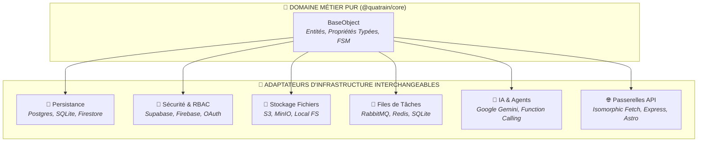

import { CoreHero, CoreFeatureCard, CoreStatusBadge } from '../components'
import { Tabs } from 'nextra/components'

<CoreHero />

---

## ⚡ Démarrage Rapide

Choisissez votre gestionnaire de paquets préféré pour intégrer Quatrain Core à votre projet :

<Tabs items={['Bun', 'Yarn 4', 'npm', 'Tycho Knowledge']}>
  <Tabs.Tab>
    ```bash
    # Installation du socle de domaine et de l'adaptateur PostgreSQL
    bun add @quatrain/core @quatrain/backend-postgres
    ```
  </Tabs.Tab>
  <Tabs.Tab>
    ```bash
    # Installation via Yarn 4 Berry
    yarn add @quatrain/core @quatrain/backend-postgres
    ```
  </Tabs.Tab>
  <Tabs.Tab>
    ```bash
    # Installation standard via npm
    npm install @quatrain/core @quatrain/backend-postgres
    ```
  </Tabs.Tab>
  <Tabs.Tab>
    ```bash
    # Annexer la base de connaissances OKF v0.1 directement dans votre agent IA
    tycho knowledge install quatrain/quatrain-core
    ```
  </Tabs.Tab>
</Tabs>

---

## 🏛️ Les 6 Piliers Fondamentaux

Quatrain structure votre code en couches orthogonales pour garantir une maintenabilité à horizon 15 ans :

<div className="grid grid-cols-1 md:grid-cols-2 lg:grid-cols-3 gap-5 my-6">
  <CoreFeatureCard
    icon="🏛️"
    layer="Couche 1 · Domaine"
    badge="Pureté 100%"
    badgeLevel="optimal"
    title="Architecture Hexagonale"
    description="Entités BaseObject pures et sérialisables. Zéro dépendance d'infrastructure dans votre logique métier."
    href="/core/okf/domain-modeling"
  />
  <CoreFeatureCard
    icon="💾"
    layer="Couche 2 · Persistance"
    badge="Multi-Bases"
    badgeLevel="brand"
    title="Persistance Polyglotte"
    description="Repository pattern dynamique. Basculez de PostgreSQL à SQLite ou Firestore sans retoucher vos modèles."
    href="/core/okf/persistence-adapters"
  />
  <CoreFeatureCard
    icon="🔐"
    layer="Couche 3 · Sécurité"
    badge="Zero-Trust"
    badgeLevel="nominal"
    title="Auth & RBAC / FLS"
    description="Field-Level Security (FLS) déclarative et authentification multi-fournisseurs (Supabase, Firebase, OAuth)."
    href="/core/okf/auth-and-security"
  />
  <CoreFeatureCard
    icon="📨"
    layer="Couche 4 · Messaging"
    badge="Non-Bloquant"
    badgeLevel="brand"
    title="Queues & Streaming"
    description="Workers asynchrones résilients supportant RabbitMQ, Redis Streams et SQLite Queue."
    href="/core/okf/queues-and-events"
  />
  <CoreFeatureCard
    icon="🤖"
    layer="Couche 5 · IA & Cognition"
    badge="Google GenAI"
    badgeLevel="optimal"
    title="IA Cognitive & Gemini"
    description="Intégration Google Gemini officielle avec génération JSON structurée garantie par des schémas stricts."
    href="/core/okf/ai-and-agents"
  />
  <CoreFeatureCard
    icon="🧠"
    layer="Couche 6 · Knowledge"
    badge="OKF v0.1"
    badgeLevel="brand"
    title="Base de Connaissances OKF"
    description="Format ouvert pour agents de codage LLM. Navigation par divulgation progressive annexable via Tycho."
    href="/core/okf"
  />
</div>

---

## 📐 Vue d'Ensemble de l'Hexagone

Les entités métiers vivent au cœur du système et ne connaissent jamais les détails de leurs adaptateurs :



---

## 💻 Exemple Minimaliste en 30 Secondes

Déclarez une entité purement métier, puis persistez-la sans boilerplate :

```typescript
import { Core, PersistedBaseObject, StringProperty, BooleanProperty } from '@quatrain/core'
import { Backend } from '@quatrain/backend'
import { PostgresAdapter } from '@quatrain/backend-postgres'

// 1. Définition de l'entité avec typage strict
export class Project extends PersistedBaseObject {
  static override PROPS_DEFINITION = {
    name: { type: StringProperty.TYPE, required: true },
    isActive: { type: BooleanProperty.TYPE, default: true }
  }
}
Core.addClass('Project', Project)

// 2. Enregistrement de l'adaptateur de persistance
Backend.addBackend(new PostgresAdapter({ connectionString: process.env.DATABASE_URL }), 'default', true)

// 3. Utilisation fluide via le Repository Pattern
const repo = Project.repository()
const project = await repo.create({ name: 'Quatrain Community Portal' })
console.log(`Projet créé avec ID : ${project.id}`)
```

---

## 🚀 Prêt à Explorer ?

<div className="grid grid-cols-1 md:grid-cols-2 gap-5 my-6">
  <CoreFeatureCard
    icon="📖"
    title="Consulter la base OKF"
    description="Accédez aux fiches conceptuelles couvrant le Repository Pattern, le FSM, le RBAC et les queues."
    href="/core/okf"
  />
  <CoreFeatureCard
    icon="📦"
    title="Explorer les 71 Packages"
    description="Naviguez dans le catalogue complet des modules avec liens directs vers la documentation et l'API TypeDoc."
    href="/core/packages"
  />
</div>
